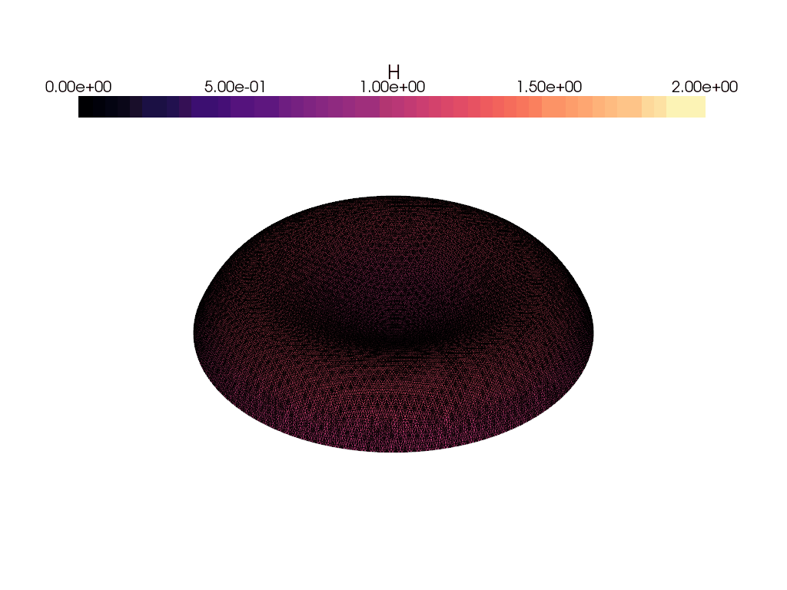

# me700-final
[](https://www.python.org/)

[](https://github.com/sandialabs/sibl#license)

[](https://codecov.io/gh/rtengle/me700-final)
[](https://github.com/rtengle/me700-final/actions)

## Overview

This codebase simulates the surface evolution of a temperature-controlled liquid space telescope using FEniCSx. In this system, a thin film of fluid sits atop a solid spherical surface with a prescribed base temperature. The top surface is free to deform and points into the deep vacuum of space where energy is released via radiation. 


The dynamics of this system is largely governed by two mechanisms: Surface tension where curvature along the fluid surface generates a surface pressure; and themocapillary flow where temperature gradients along a surface generates shear flow, draining the thin film from hot spots and into cold spots. With these effects the surface can be manipulated by prescribing a temperature profile at the solid surface the film sits atop. For the liquid space telescope, the following non-dimensional equation describes the time evolution of the fluid surface:

```math
\frac{\partial H}{\partial \tau} + \nabla \cdot \left( \frac{1}{3} S H^3 \nabla(\nabla^2 H) + \frac{1}{2} H^2 \nabla \theta_H \right) = 0
```
 
```math
\theta_H = \theta_0 - \frac{F}{K} H
```

where $H$ describes the fluid thickness and $\theta$ describes the fluid temperature. While steady-state solutions can be easily derived for a given fluid, not much is known about the evolution of a fluid surface shape including how stable these steady-states are. 

## Usage and Parameters

To set up the environment, run the following commands:

```
module load miniconda
mamba create -n fenicsx-env
mamba activate fenicsx-env
mamba install -c conda-forge fenics-dolfinx mpich pyvista
pip install -e .
```

With the environment set up, call ```run_sim(params)``` with ```params``` being a dictionary containing the following parameters:

```
flat : Whether the film rests on a flat surface or a curved spherical surface
gamma0 : Polar dista covered by the telescope surface
theta0 : Function describing the temperature profile
S : Surface tension constant
F/K : Ratio between the view factor F and the non-dimensional conductivity K
minsize : Minimum element size of the mesh
maxsize : Maximum element size of the mesh
Hpin : Pinned height of the fluid surface at the edge
etapin : Laplacian of the fluid surface at the edge
H0 : Starting fluid height
dt : Time step size
N : Number of steps
degree : Element degree
rtol : Relative tolerance of solver
foldername : Folder name for results data
filename : File name for results data
plot : Boolean for if a gif is produced
figurename : Name of gif file
```

The method ```run_sim``` is found in ```run_sim.py```. 

## Scheme Overview

This problem is solved using a weak formulation plus an implicit scheme to solve for an updated fluid surface at each time step and iterate it one step forward. We then save the current surface as the previous one and iterate until all time steps have been solved for. 

The software uses the NonlinearProblem to define the residual and jacobian and uses a direct Newton-Krylov nonlinear solver to find the H and eta at each time step. The solver and settings were copied from the Cahn-Hillard ```dolfinx``` tutorial.

## Validation 

While there are no known time-dependent solutions to the equation, it is faily easy to find a steady-state solution for a given surface.
The above shows the surface deformation for the following conditions:

```math
H = 1 - r^2 + r^4 \qquad H(r=1) = 1 \qquad \nabla^2H(r = 1) = -12
```

```math
\theta_0 = -\frac{64}{3} S \left(\frac{1}{2} r^2 + \frac{1}{4} r^4 - \frac{1}{6}r^6 \right) + \frac{F}{K} (1 - r^2 + r^4)
```

If this truly is a steady-state solution, setting these as temperature distribution, initial surface geometry, and surface boundary conditions should result in a steady-state simulation. This problem is reflected in ```check_steady_state``` in ```run_sim```. The following gif shows the simulation results.



As seen in the gif, the simulation is stable for the initial time steps and acts as a validation. Something to note is that these steady-state solutions were not expected to be stable. It can be shown for some temperature distributions that a stable steady-state can be achieved, but for this solution steady-state is not achieved. If this is run long enough, the solution will no longer be steady-state and will start infinitely drawing in fluid towards the center. Either way, it's a good enough validation that the simulation is reflecting the desired PDE.

## Code Structure

The main code is split into three parts: ```meshing``` which handles constructing the model and meshing it; ```weak_form``` which assembles the function space, weak formulation, and constructs the solver; and finally ```solver_loop``` which performs the implicit scheme to solve for the film surface at each time step. These are all called from the functions in ```run_sim``` which is the main access point for the user.

## Skillsets

Skills used from ME700:

- Constructing numerical simulations with FEniCSx
    - Deriving a weak form of a PDE
    - Constructing an implicit scheme for a time-dependent PDE from a weak form
    - Creating meshes with specified boundaries using gmsh
    - Implementing a mixed-element system with dirichlet bc using dolfinx
    - Saving the results as a vtk using dolfinx
    - Understanding the dolfinx API
    - Visualizing the results through pyvista to create animations of the simulation
- Automated testing and code validation
    - Constructing meaningful code tests using pytest
    - Implementing automatic code validation and coverage checking through github actions
- Simulation validation and results interpretation
    - Test basic cases against expected behavior as first-pass check
    - Constructing a known analytical solution and implementing it to test simulation code
    - Compare simulation results with known results from other simulation work
- Learning and using open source software
    - Referencing tutorials and other work to see how to accomplish a task
    - Digging through API manuals to understand how a method is used, what edge cases exist, etc.
    - Researching error codes to find and implement resolutions